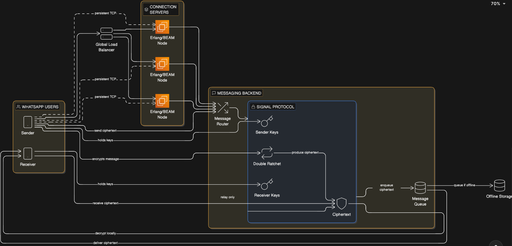

# WhatsApp E2E Encryption Demo

A TypeScript implementation demonstrating End-to-End encryption principles inspired by WhatsApp's architecture.

## Architecture




## Key Principles

> **Zero-Knowledge Server**: The server never has access to plaintext messages or private keys at any point in the flow.

- ✅ Client-side encryption
- ✅ Server-blind routing
- ✅ Offline message queuing
- ✅ Device-only decryption
- ✅ True End-to-End Encryption

## Project Structure

```
src/
├── client.ts           # Encrypts messages
├── connectionServer.ts # Receives ciphertext
├── messageRouter.ts    # Routes & queues messages
├── receiver.ts         # Decrypts on device
└── index.ts            # Demo runner
```

## Running the Demo

```bash
npm install
npm run dev
```

## Demo Output

The demo shows three scenarios:

1. **Offline Queuing**: Alice sends message while Bob is offline
2. **Queue Delivery**: Bob comes online and receives queued messages
3. **Live Delivery**: Alice sends message to online Bob

Each scenario demonstrates that the server only handles ciphertext.

## Tech Stack

- TypeScript
- Node.js
- Base64 encoding (simplified encryption for demo)

## Note

This is a simplified demonstration for educational purposes. Production E2E encryption uses protocols like Signal Protocol with proper key exchange, forward secrecy, and authenticated encryption.
